# CarMarket - AI-Powered Car Marketplace

## 1. Project Title
**CarMarket** - A modern Android car marketplace application with AI-powered recommendations and intelligent chat assistance.

## 2. Problem Description
CarMarket addresses the real-world problem of car shopping by providing users with an intelligent, user-friendly platform to browse, search, and discover vehicles. The app serves car buyers who need:

- **Efficient car discovery**: Users can easily browse and filter cars by make, model, price, and specifications
- **Intelligent recommendations**: AI-powered chat assistant provides personalized car suggestions based on user preferences
- **Offline accessibility**: Local caching ensures users can browse cars even without internet connectivity
- **Personalized experience**: Users can save favorites and get tailored recommendations

The solution is relevant because it combines modern mobile technology with AI to create a seamless car shopping experience, reducing the time and effort required to find the perfect vehicle.

## 3. Features Overview
- **CRUD Operations**: Complete car browsing, searching, and detailed viewing
- **Room Storage**: Local database for offline car browsing and favorites management
- **Retrofit Integration**: RESTful API communication with backend services
- **WorkManager Scheduling**: Background car data synchronization
- **DataStore Preferences**: User preferences and theme management
- **Navigation 3**: Modern navigation with type-safe routing and serializable screen definitions
- **Generative AI Features**: Intelligent chat assistant for car recommendations
- **Organized Data Layer**: Separated DTOs, UI states, and data mappers for better maintainability
- **Favorites Management**: Save and manage favorite cars
- **Image Carousel**: Interactive car image galleries
- **Search & Filtering**: Advanced car search with multiple criteria
- **Theme Support**: Dark/light theme switching

## 4. System Architecture

The application follows **Clean Architecture** principles with clear separation of concerns across three main layers:

### Architecture Layers:
- **Presentation Layer**: UI components, ViewModels, and user interactions
- **Domain Layer**: Business logic, use cases, and domain models
- **Data Layer**: Repository implementations, local storage, and remote API

### Architecture Diagram:
```
┌─────────────────────────────────────────────────────────────┐
│                    PRESENTATION LAYER                      │
│  ┌─────────────┐ ┌─────────────┐ ┌─────────────┐          │
│  │   Home      │ │   Detail    │ │    Chat     │          │
│  │  Screen     │ │   Screen    │ │   Screen    │          │
│  └─────────────┘ └─────────────┘ └─────────────┘          │
│  ┌─────────────┐ ┌─────────────┐ ┌─────────────┐          │
│  │ Favorites   │ │  Profile    │ │ Navigation  │          │
│  │  Screen     │ │   Screen    │ │   System    │          │
│  └─────────────┘ └─────────────┘ └─────────────┘          │
└─────────────────────────────────────────────────────────────┘
                              │
                              ▼
┌─────────────────────────────────────────────────────────────┐
│                     DOMAIN LAYER                           │
│  ┌─────────────┐ ┌─────────────┐ ┌─────────────┐          │
│  │   Use       │ │ Repository  │ │   Domain    │          │
│  │  Cases      │ │ Interfaces  │ │   Models    │          │
│  └─────────────┘ └─────────────┘ └─────────────┘          │
└─────────────────────────────────────────────────────────────┘
                              │
                              ▼
┌─────────────────────────────────────────────────────────────┐
│                      DATA LAYER                            │
│  ┌─────────────┐ ┌─────────────┐ ┌─────────────┐          │
│  │ Repository  │ │   Local     │ │   Remote    │          │
│  │Implementations│ │  Storage    │ │     API     │          │
│  └─────────────┘ └─────────────┘ └─────────────┘          │
│  ┌─────────────┐ ┌─────────────┐ ┌─────────────┐          │
│  │    Room     │ │ DataStore   │ │  WorkManager│          │
│  │  Database   │ │ Preferences │ │   Workers   │          │
│  └─────────────┘ └─────────────┘ └─────────────┘          │
└─────────────────────────────────────────────────────────────┘
```

## 5. Use Case Diagram

```mermaid
graph TD
    A[User] --> B[Browse Cars]
    A --> C[Search Cars]
    A --> D[View Car Details]
    A --> E[Add to Favorites]
    A --> F[Chat with AI Assistant]
    A --> G[Manage Profile]
    
    B --> H[Filter by Make/Model]
    B --> I[Filter by Price Range]
    B --> J[Filter by Body Type]
    
    C --> K[Text Search]
    C --> L[Advanced Filters]
    
    D --> M[View Images]
    D --> N[View Specifications]
    D --> O[Contact Seller]
    
    E --> P[Save Favorite]
    E --> Q[Remove Favorite]
    E --> R[View Favorites List]
    
    F --> S[Get AI Recommendations]
    F --> T[Ask Questions]
    F --> U[Receive Car Suggestions]
    
    G --> V[Update Profile]
    G --> W[Change Theme]
    G --> X[Logout]
```



## 6. Technology Stack

| Category                 | Technology         | Version    | Purpose                      |
| ------------------------ | ------------------ | ---------- | ---------------------------- |
| **Language**             | Kotlin             | 2.1.0      | Primary development language |
| **UI Framework**         | Jetpack Compose    | 2025.10.00 | Modern declarative UI        |
| **Architecture**         | Clean Architecture | -          | Separation of concerns       |
| **Dependency Injection** | Hilt               | 2.57.2     | Dependency injection         |
| **Navigation**           | Navigation Compose | 2.9.5      | Type-safe navigation         |
| **Local Database**       | Room               | 2.8.2      | Local data persistence       |
| **Preferences**          | DataStore          | 1.1.7      | User preferences storage     |
| **Network**              | Retrofit           | 3.0.0      | HTTP client                  |
| **Background Tasks**     | WorkManager        | 2.10.5     | Background synchronization   |
| **Image Loading**        | Coil               | 2.7.0      | Image loading and caching    |
| **Testing**              | JUnit              | 4.13.2     | Unit testing                 |
| **Testing**              | MockWebServer      | 4.10.0     | API testing                  |
| **Generative AI**        | Custom AI API      | -          | Chat recommendations         |

## 7. Package Hierarchy

```
com.cars.cars_marketplace/
├── data/                           # Data Layer
│   ├── local/                      # Local Storage
│   │   ├── dao/                    # Data Access Objects
│   │   │   ├── CarDao.kt
│   │   │   └── FavoriteDao.kt
│   │   ├── entity/                 # Room Entities
│   │   │   ├── CarEntity.kt
│   │   │   └── FavoriteEntity.kt
│   │   └── database/
│   │       └── AppDatabase.kt
│   ├── remote/                     # Remote API
│   │   ├── api/
│   │   │   └── ApiService.kt
│   │   └── dto/                     # Data Transfer Objects
│   │       ├── CarDtos.kt          # Car-related DTOs
│   │       ├── AiDtos.kt           # AI chat DTOs
│   │       └── CommonDtos.kt       # Generic API responses
│   ├── repository/                 # Repository Implementations
│   │   ├── CarRepositoryImpl.kt
│   │   ├── FavoriteRepositoryImpl.kt
│   │   └── AiRepositoryImpl.kt
│   ├── mapper/                      # Data Mappers
│   │   ├── CarMappers.kt           # Car entity/DTO mappers
│   │   └── AiMappers.kt            # AI response mappers
│   └── worker/                      # Background Workers
│       └── SyncCarsWorker.kt
├── domain/                         # Domain Layer
│   ├── model/                      # Domain Models
│   │   ├── Car.kt
│   │   ├── ChatMessage.kt
│   │   └── Resource.kt
│   ├── repository/                 # Repository Interfaces
│   │   ├── CarRepository.kt
│   │   ├── FavoriteRepository.kt
│   │   └── AiRepository.kt
│   └── usecase/                    # Use Cases
│       ├── GetCarsUseCase.kt
│       ├── GetCarByIdUseCase.kt
│       ├── ToggleFavoriteUseCase.kt
│       └── SendChatMessageUseCase.kt
├── presentation/                    # Presentation Layer
│   ├── home/                       # Home Screen
│   │   ├── HomeScreen.kt
│   │   ├── HomeViewModel.kt
│   │   └── CarCard.kt
│   ├── detail/                     # Car Detail Screen
│   │   ├── CarDetailScreen.kt
│   │   └── CarDetailViewModel.kt
│   ├── favorites/                  # Favorites Screen
│   │   ├── FavoritesScreen.kt
│   │   └── FavoritesViewModel.kt
│   ├── chat/                       # AI Chat Screen
│   │   ├── ChatScreen.kt
│   │   └── ChatViewModel.kt
│   ├── navigation/                 # Navigation
│   │   ├── AppNavHost.kt
│   │   ├── TypeSafeNavHost.kt      # Navigation 3 implementation
│   │   ├── NavigationExtensions.kt # Type-safe navigation utilities
│   │   └── Screen.kt               # Serializable screen definitions
│   └── common/                     # Shared Components
│       ├── ui/                      # UI State Definitions
│       │   ├── HomeUiState.kt      # Home screen states
│       │   ├── ChatUiState.kt      # Chat screen states
│       │   └── CarDetailUiState.kt # Car detail states
│       ├── AnimatedIcon.kt
│       ├── AppTopBar.kt
│       ├── BottomNavBar.kt
│       ├── EmptyState.kt
│       ├── ErrorMessage.kt
│       └── LoadingIndicator.kt
├── di/                            # Dependency Injection
│   ├── DatabaseModule.kt
│   ├── NetworkModule.kt
│   ├── RepositoryModule.kt
│   └── ImageModule.kt
├── util/                          # Utilities
│   ├── DataStoreManager.kt
│   └── ThemeManager.kt
└── ui/                           # UI Theme
    └── theme/
        ├── Color.kt
        ├── Theme.kt
        └── Type.kt
```

## 8. Screen Flow

### Main Application Flow:
1. **Home Screen**: Grid view of cars with search and filtering
2. **Car Detail Screen**: Detailed car information with image carousel
3. **Favorites Screen**: User's saved favorite cars
4. **AI Chat Screen**: Interactive chat with AI assistant for recommendations
5. **Navigation**: Bottom navigation between main screens

*Note: Screenshots would be added here showing the actual UI flow*

## 9. Setup Instructions

### Prerequisites:
- Android Studio Hedgehog or later
- Android SDK 30 or higher
- Kotlin 2.1.0
- Gradle 8.13.0

### Installation Steps:

1. **Clone the repository:**
   ```bash
   git clone <repository-url>
   cd CarMarket
   ```

2. **Open in Android Studio:**
   - Open Android Studio
   - Select "Open an existing project"
   - Navigate to the CarMarket folder
   - Click "OK"

3. **Sync the project:**
   - Android Studio will automatically sync Gradle files
   - Wait for the sync to complete

4. **Run the application:**
   - Connect an Android device or start an emulator
   - Click the "Run" button (green play icon)
   - Select your target device
   - The app will build and install on your device

### Configuration:
- The app is configured to use the backend API at: `https://mobile-project-backend-6elr.onrender.com`
- No additional configuration is required for basic functionality

## 10. API Reference

### Base URL:
```
https://mobile-project-backend-6elr.onrender.com
```

### Key Endpoints:

| Endpoint                 | Method | Description                 |
| ------------------------ | ------ | --------------------------- |
| `/api/cars`              | GET    | Get paginated list of cars  |
| `/api/cars/{id}`         | GET    | Get car details by ID       |
| `/api/cars/search`       | GET    | Search cars by query        |
| `/api/ai/chat`           | POST   | AI chat for recommendations |
| `/api/favorites`         | GET    | Get user's favorite cars    |
| `/api/favorites`         | POST   | Add car to favorites        |
| `/api/favorites/{carId}` | DELETE | Remove car from favorites   |

### Example API Usage:
```kotlin
// Get cars with filters
GET /api/cars?page=1&limit=20&make=Toyota&minPrice=10000&maxPrice=50000

// AI Chat request
POST /api/ai/chat
{
  "message": "I'm looking for a reliable SUV under $30,000"
}
```

## 11. Data Models

### Domain Models:

#### Car Entity:
```kotlin
data class Car(
    val id: String,
    val make: String,
    val model: String,
    val year: Int,
    val price: Double,
    val bodyType: String? = null,
    val mileage: Int? = null,
    val color: String? = null,
    val description: String? = null,
    val images: List<String> = emptyList(),
    val transmission: String? = null,
    val fuelType: String? = null,
    val features: List<String> = emptyList(),
    val location: String? = null,
    val status: String? = null,
    val userId: String? = null,
    val createdAt: String? = null,
    val updatedAt: String? = null
)
```

#### ChatMessage Entity:
```kotlin
data class ChatMessage(
    val id: String,
    val content: String,
    val isUser: Boolean,
    val timestamp: Long
)
```

#### Resource Wrapper:
```kotlin
sealed class Resource<T> {
    data class Success<T>(val data: T) : Resource<T>()
    data class Error<T>(val message: String?, val throwable: Throwable? = null) : Resource<T>()
    class Loading<T> : Resource<T>()
}
```

### Room Entities:

#### CarEntity:
```kotlin
@Entity(tableName = "cars")
data class CarEntity(
    @PrimaryKey val id: String,
    val make: String,
    val model: String,
    val year: Int,
    val price: Double,
    val bodyType: String?,
    val mileage: Int?,
    val color: String?,
    val description: String?,
    val imagesSerialized: String = ""
)
```

#### FavoriteEntity:
```kotlin
@Entity(tableName = "favorites")
data class FavoriteEntity(
    @PrimaryKey val carId: String,
    val addedAt: Long = System.currentTimeMillis()
)
```

## 12. Testing (ViewModel Testing)

### HomeViewModel Test Example:

```kotlin
class HomeViewModelTest {
    
    @Test
    fun toggleFavorite_optimistic_and_revert_on_error() = runBlocking {
        // Given
        val carRepo = FakeCarRepository(sampleCars)
        val favRepo = FakeFavoriteRepository(initial = emptyList(), succeed = false)
        
        val getCarsUseCase = GetCarsUseCase(carRepo)
        val getFavoritesUseCase = GetFavoritesUseCase(favRepo)
        val toggleFavoriteUseCase = ToggleFavoriteUseCase(favRepo)
        
        val vm = HomeViewModel(getCarsUseCase, getFavoritesUseCase, toggleFavoriteUseCase)
        
        // When - Toggle favorite (will fail)
        vm.toggleFavorite("1")
        
        // Then - Optimistic update should be reverted
        assertEquals(emptySet<String>(), vm.favoriteIds.value)
    }
    
    @Test
    fun toggleFavorite_success_keeps_favorite() = runBlocking {
        // Given
        val carRepo = FakeCarRepository(sampleCars)
        val favRepo = FakeFavoriteRepository(initial = emptyList(), succeed = true)
        
        val getCarsUseCase = GetCarsUseCase(carRepo)
        val getFavoritesUseCase = GetFavoritesUseCase(favRepo)
        val toggleFavoriteUseCase = ToggleFavoriteUseCase(favRepo)
        
        val vm = HomeViewModel(getCarsUseCase, getFavoritesUseCase, toggleFavoriteUseCase)
        
        // When
        vm.toggleFavorite("2")
        
        // Then - Should keep the favorite
        assertEquals(setOf("2"), vm.favoriteIds.value)
    }
}
```

### Test Coverage:
- **Unit Tests**: ViewModel logic, use cases, and repository implementations
- **Integration Tests**: Complete user flows and API interactions
- **Mock Testing**: API service mocking for reliable testing

## 13. Generative AI Integration

### AI Chat Implementation:

The app integrates with a custom AI backend that provides intelligent car recommendations through natural language chat.

#### AI Chat Flow:
```kotlin
// User sends message
viewModel.sendMessage("I'm looking for a reliable SUV under $30,000")

// AI processes and responds with recommendations
val result = sendChatMessageUseCase(message)
when (result) {
    is Resource.Success -> {
        // Display AI response and recommended cars
        val aiMessage = ChatMessage(
            id = UUID.randomUUID().toString(),
            content = result.data.data.message,
            isUser = false,
            timestamp = System.currentTimeMillis()
        )
        _messages.value = _messages.value + aiMessage
        
        // Update recommended cars
        _recommendedCars.value = result.data.data.recommendedCars
    }
    is Resource.Error -> {
        // Handle error gracefully
    }
}
```

#### AI Features:
- **Natural Language Processing**: Understands user queries in plain English
- **Contextual Recommendations**: Provides relevant car suggestions based on user preferences
- **Interactive Chat**: Real-time conversation with typing indicators
- **Smart Filtering**: AI can filter and recommend cars based on complex criteria

#### Code Snippet - AI Repository:
```kotlin
class AiRepositoryImpl @Inject constructor(
    private val api: ApiService
) : AiRepository {
    
    override suspend fun chat(request: AiChatRequest): Resource<AiChatResponse> {
        return try {
            val response = api.chat(request)
            Resource.Success(response)
        } catch (e: Exception) {
            Resource.Error(e.message, e)
        }
    }
}
```

#### AI Prompt Example:
```
User: "I need a family car that's fuel efficient and safe"
AI Response: "Based on your requirements, I recommend these family-friendly, fuel-efficient, and safe vehicles..."
```

*Note: Screenshot of AI chat interface would be added here*

## 14. Recent Structural Improvements

### Code Organization Enhancements:

#### 1. **Separated DTOs** (Data Transfer Objects):
- **Before**: All DTOs in single `RemoteDtos.kt` file
- **After**: Organized into specific files:
  - `CarDtos.kt` - Car-related DTOs (`CarDto`, `CarsResponse`, `SearchResponse`)
  - `AiDtos.kt` - AI chat DTOs (`AiChatRequest`, `AiChatResponse`)
  - `CommonDtos.kt` - Generic API responses (`ApiResponse`)

#### 2. **Separated UI States**:
- **Before**: UI states defined inline within ViewModels
- **After**: Dedicated state files:
  - `HomeUiState.kt` - Home screen states (Loading, Success, Error)
  - `ChatUiState.kt` - Chat screen states (Idle, Loading, Error)
  - `CarDetailUiState.kt` - Car detail states (Loading, Success, Error)

#### 3. **Data Layer Reorganization**:
- **Added Mappers Package**: Centralized data transformation
  - `CarMappers.kt` - Car entity/DTO conversion functions
  - `AiMappers.kt` - AI response mapping functions
- **Type-Safe Navigation**: Navigation 3 implementation with serializable screens
- **Extension Functions**: Clean, reusable mapping utilities

#### 4. **Navigation 3 Implementation**:
- **Type-Safe Screens**: Serializable screen definitions with `@Serializable` annotations
- **Navigation Extensions**: Type-safe navigation utilities
- **TypeSafeNavHost**: Clean NavHost wrapper for Navigation 3
- **Compile-Time Safety**: All navigation is now type-safe and validated at compile time

### Benefits of These Improvements:
- **Better Maintainability**: Easier to find and modify specific functionality
- **Improved Testability**: Isolated components are easier to test
- **Enhanced Developer Experience**: Clear separation of concerns
- **Type Safety**: Compile-time validation prevents runtime navigation errors
- **Scalability**: Easier to add new features and screens

## 15. Future Enhancements / Limitations

### Potential Improvements:
- **Advanced AI Features**: Image recognition for car condition assessment
- **Social Features**: User reviews and ratings system
- **Payment Integration**: In-app payment processing
- **Push Notifications**: Price alerts and new car notifications
- **AR Features**: Augmented reality car visualization
- **Multi-language Support**: Internationalization
- **Offline Mode**: Enhanced offline functionality
- **Analytics**: User behavior tracking and insights

### Current Limitations:
- **Authentication**: Basic user management (could be enhanced with OAuth)
- **Image Processing**: Limited image optimization
- **Real-time Updates**: No WebSocket integration for live updates
- **Advanced Search**: Limited to basic text search
- **Performance**: Could benefit from more aggressive caching strategies

## 16. Wholeness / SCI Connection (MIU Context)

### Science of Creative Intelligence Principle: **Unified Field of Consciousness**

This CarMarket project embodies the principle of **Unified Field of Consciousness** through its holistic approach to car shopping. Just as consciousness integrates all aspects of human experience into a unified whole, this application integrates:

- **User Intent** (what they're looking for) with **AI Intelligence** (recommendations)
- **Local Storage** (personal preferences) with **Cloud Data** (global inventory)
- **Visual Experience** (images) with **Textual Information** (specifications)
- **Individual Choice** (favorites) with **Collective Intelligence** (AI recommendations)

The app creates a seamless, unified experience where technology serves human consciousness, making the complex process of car shopping feel natural and intuitive. This reflects the SCI principle that consciousness is the fundamental organizing principle of the universe, and technology should enhance rather than complicate human experience.

## 17. Author / Contributors

- Eyob Hailu (Mobile) | 618991
- Natoli Dinku (backend api & cloud deployement)  | 619017


CS473 - Mobile Application Development  
Oct 2025  
CarMarket - AI-Powered Car Marketplace  

---

*This project demonstrates mastery of modern Android development with Clean Architecture, AI integration, and comprehensive testing practices.*
